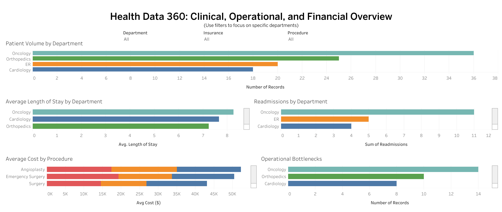

# Health Data 360
Healthcare Analytics Dashboard | Tableau, Excel

## Overview
Health Data 360 is an interactive healthcare analytics dashboard designed to mirror the types of clinical, operational, and financial questions faced by large hospital systems. The project demonstrates how data from multiple domains can be brought together to support clearer decision-making, operational efficiency, and improved patient care.

The dashboard was built using Tableau and Excel, with a focus on usability, clarity, and realistic healthcare scenarios.

## Key Questions Addressed
This dashboard helps answer practical healthcare analytics questions such as:

• Which departments handle the highest patient volume  
• How does average length of stay vary by department  
• Which departments contribute most to readmissions  
• What procedures drive higher average costs  
• Where operational bottlenecks are most common  

Filters allow users to focus on specific departments, insurance types, or procedures, reflecting how stakeholders explore data in real healthcare environments.

## Dashboard Components
The dashboard includes the following views:

• Patient Volume by Department  
• Average Length of Stay by Department  
• Readmissions by Department (Top contributors)  
• Average Cost by Procedure  
• Operational Bottlenecks by Department  

To reduce visual clutter and highlight actionable insights, readmissions are displayed using a Top N approach, while other views provide full departmental context.

## Design Decisions
Several design choices were made intentionally:

• Horizontal bar charts were used for easier comparison across departments  
• Filters are centralized at the top to drive focused analysis  
• Dense categories are managed through filtering rather than forced compression  
• The dashboard prioritizes clarity over decoration to match healthcare reporting standards  

These decisions align with how hospital leadership and analytics teams typically consume data.

## Data
All data used in this project is privacy safe and created to simulate real healthcare scenarios. No real patient information is included.

## Tools Used
• Tableau Public  
• Microsoft Excel  

## Live Dashboard
View the interactive dashboard here:
https://public.tableau.com/app/profile/ishan.rajani1037/viz/Book1_17683349722650/Dashboard1?publish=yes

## Screenshot

*Static preview of the interactive Tableau dashboard*

## Why This Project
This project was created to demonstrate readiness for healthcare data analyst roles by showcasing:

• Analytical thinking applied to healthcare problems  
• Practical dashboard design choices  
• Ability to translate complex data into usable insights  
• Familiarity with metrics commonly used in hospital systems  
